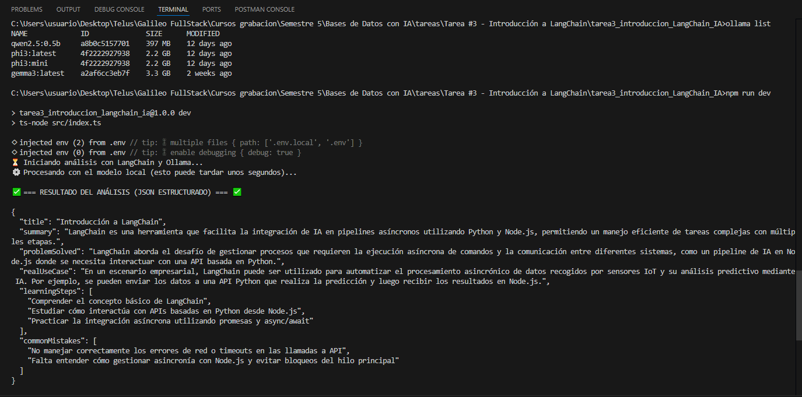

# Tarea #3 - Introducción a LangChain con Ollama

## 🎯 Objetivo de la Tarea

Introducir el uso práctico de LangChain como framework para construir aplicaciones que integran modelos de lenguaje con código reutilizable, prompts dinámicos y flujos secuenciales de procesamiento, devolviendo una salida estructurada en JSON.

## 📋 Requisitos Previos

- Node.js y npm instalados.
- [Ollama](https://ollama.com/) instalado y ejecutándose localmente.
- Modelo descargado en Ollama (ej. `llama3.2` o `gemma3`).

## ⚙️ Instalación y Configuración

1. Clonar el repositorio.
2. Instalar las dependencias:

```bash
   npm install
```

3. Crear un archivo .env basado en .env.example y configurar las variables:

```bash
    OLLAMA_BASE_URL=http://localhost:11434
    OLLAMA_MODEL=phi3:mini
```

4. Verificar que Ollama esté activo y el modelo descargado:

```bash
    ollama list
    ollama pull phi3:mini # Usare este modelo debido a limitaciones de recursos en PC para usar gemma3
```

## 🚀 Ejecución del Proyecto

Para ejecutar la aplicación, utiliza el siguiente comando en la terminal:

```bash
npm run dev
```

## 🧠 Conceptos Clave y Flujo de la Aplicación

### ¿Qué es LangChain?

LangChain es un framework diseñado para facilitar la creación de aplicaciones impulsadas por modelos de lenguaje (LLMs). Proporciona una arquitectura modular que permite conectar modelos de IA con fuentes de datos, herramientas externas y lógicas de procesamiento secuencial.

### Diferencia entre llamar directamente a un LLM y usar LangChain

Si llamamos directamente a un LLM a través de su API nativa, obtenemos texto libre y no determinista, lo que dificulta su integración en un software estricto. LangChain, en cambio, actúa como un orquestador. En este proyecto nos permite usar un parser (Zod) para "obligar" al LLM a devolver la respuesta en una estructura JSON válida, facilitando que otro sistema (como una base de datos o un frontend) consuma esos datos sin errores.

### Explicación del Flujo Implementado

El proyecto sigue el siguiente flujo secuencial (Chain):

1. **Datos de entrada**: Se definen las variables dinámicas (topic, studentLevel, expectedUseCase).
2. **Prompt Template**: Las variables se inyectan en una plantilla (topicPrompt.ts), generando las instrucciones de sistema y de usuario.
3. **Modelo de Lenguaje**: La configuración en model.ts instancia la conexión con el modelo local de Ollama.
4. **Parser / Esquema**: topicAnalysisSchema.ts (con Zod) define la estructura estricta del JSON esperado.
5. **Respuesta Final**: La cadena (topicAnalysisChain.ts) conecta las piezas de entrada a salida, y el resultado es parseado e impreso en consola mediante index.ts.

## 📸 Evidencia de Ejecución (Resultado Obtenido)

A continuación, se presenta la captura del resultado estructurado en formato JSON tras ejecutar la aplicación exitosamente con el modelo phi3:mini.


